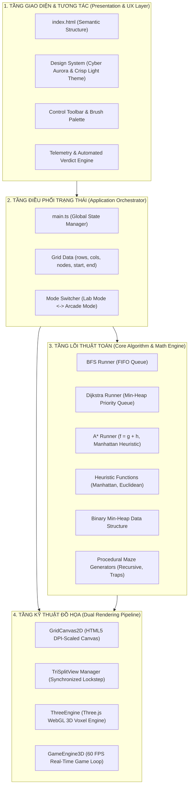

# 01. Kiến Trúc Hệ Thống & Thiết Kế Module (System Architecture)

> **Dự án:** PathQuest 2D/3D (Pro Edition)  
> **Tác giả:** Đội ngũ Nghiên cứu & Phát triển PathQuest  
> **Phiên bản:** 2.0.0  
> **Cập nhật:** 2026  

---

## 1. Tổng Quan Hệ Thống (System Overview)

**PathQuest 2D/3D** là nền tảng web tương tác hiệu năng cao được thiết kế nhằm mô phỏng, đối chiếu khoa học và trực quan hóa các thuật toán tìm đường (Pathfinding) trong không gian lưới 2D/3D. Hệ thống giải quyết bài toán cốt lõi trong Trí tuệ Nhân tạo (AI Navigation), Khoa học Dữ liệu và Kỹ thuật Game thông qua 2 phân hệ tích hợp:

1. **Phân hệ Lab Benchmark (Nghiên cứu & Đối chiếu):**
   - Không gian tương tác vẽ bản đồ tùy chỉnh với địa hình có trọng số (Terrain Weights).
   - Cơ chế chạy đua song song 3 thuật toán (Tri-Split View: BFS vs Dijkstra vs A*).
   - Khả năng **lưu vết vĩnh viễn (Trace Persistence)** cho phép người dùng quan sát hình thái lan truyền sóng (Wavefront Heatmap) và đường đi tối ưu (Golden Path) sau khi hoàn tất mô phỏng.
   - Bảng đo lường vi sai (Telemetry) và Báo cáo Kết luận Khoa học Tự động.
2. **Phân hệ Arcade Arena (Đấu Trường Game 3D Real-Time):**
   - Đưa thuật toán vào ứng dụng thực chiến trong môi trường 3D WebGL (Three.js).
   - Người chơi đối mặt với 3 NPC AI sử dụng 3 thuật toán khác nhau để săn lùng theo thời gian thực.
   - Cơ chế giăng bẫy thời gian thực ép AI phải tính lại đường đi (Dynamic Re-routing) tức thì.

---

## 2. Sơ Đồ Kiến Trúc Phân Lớp (4-Layer Architectural Diagram)

Hệ thống được thiết kế theo nguyên lý **Decoupled Architecture (Phân tách Độc lập)**, chia thành 4 lớp rõ ràng:



---

## 3. Luồng Xử Lý Dữ Liệu (Data Flow)

### 3.1. Luồng Chạy Đua Song Song (Tri-Split Race Flow)
1. **Thiết lập:** Người dùng chỉnh sửa bản đồ lưới trên Master Canvas (đặt Tường, Bùn lầy, Nước, hoặc chọn sinh Mê cung tự động).
2. **Khởi tạo dữ liệu:** Chuyển đổi ma trận `NodeType[][]` thành đồ thị trọng số `GridNode[][]`.
3. **Thực thi đồng bộ:**
   - BFS duyệt đồ thị bằng Queue $O(1)$.
   - Dijkstra duyệt đồ thị bằng Min-Heap $O(\log V)$.
   - A* duyệt đồ thị bằng Min-Heap $O(\log V)$ kết hợp Heuristic Manhattan $h(n)$.
4. **Thu thập kết quả:** Mỗi thuật toán trả về đối tượng `SearchResult` gồm: mảng tọa độ thứ tự duyệt `visitedOrder`, mảng tọa độ đường đi ngắn nhất `shortestPath`, và chỉ số đo đạc `metrics`.
5. **Diễn hoạt phân bước (Lockstep Animation):** `TriSplitView` chạy vòng lặp timer vẽ các bước sóng đồng thời trên 3 canvas phụ.
6. **Lưu vết vĩnh viễn (Trace Retention):** Khi kết thúc, trạng thái heatmap và đường đi vàng tiếp tục được hiển thị cố định trên cả 3 bản đồ con.
7. **Phân tích tự động:** `Dashboard` đối sánh số liệu và xuất Báo cáo Kết luận Khoa học.

---

## 4. Đặc Tả Tầng Đồ Họa (Rendering Pipelines)

### 4.1. 2D Canvas Renderer (`GridCanvas2D`)
- Sử dụng thẻ `<canvas>` chuẩn HTML5 với kỹ thuật nội suy DPI scaling (`window.devicePixelRatio`) giúp hình ảnh siêu sắc nét trên màn hình Retina / 4K.
- Vẽ trực tiếp trên Pixel Buffer, không phát sinh chi phí DOM Node khi mở rộng kích thước lưới ($50 \times 30 = 1500$ ô).
- Quản lý 2 tập hợp trace: `visitedSet` (sóng duyệt) và `pathSet` (đường đi) bằng `Set<string>` cho tốc độ tra cứu $O(1)$.

### 4.2. 3D WebGL Voxel Engine (`ThreeEngine` & `GameEngine3D`)
- Xây dựng trên nền tảng **Three.js (WebGL)**:
  - Tường chắn là các khối lập phương Voxel 3D nổi cao (Height = 1.4).
  - Vực nước và Bùn lầy có cao độ lún sâu và chất liệu phản xạ ánh sáng chân thực.
  - Sóng duyệt và đường đi tối ưu là các khối năng lượng phát sáng (MeshStandardMaterial với Emissive Glow).
  - Camera hỗ trợ điều khiển xoay 360° tự do (OrbitControls), nút chuyển nhanh góc **Isometric** và góc **Top-Down**.

---

## 5. Cấu Trúc Thư Mục Dự Án (Directory Layout)

```
d:/Slide_THPT/VuLeTrungHieu_AI/src/
├── docs/                               # Toàn bộ tài liệu hệ thống & báo cáo khoa học
│   ├── 01_SYSTEM_ARCHITECTURE.md       # Kiến trúc hệ thống
│   ├── 02_ALGORITHMS_AND_BENCHMARKS.md # Báo cáo thuật toán & đối sánh thực nghiệm
│   ├── 03_USER_AND_GAME_GUIDE.md       # Cẩm nang người dùng & hướng dẫn chơi game
│   └── 04_TECHNICAL_SPECS_AND_API.md   # Đặc tả kỹ thuật & tham chiếu mã nguồn
├── src/
│   ├── components/                     # Giao diện Dashboard & Báo cáo tự động
│   │   └── Dashboard.ts
│   ├── core/                           # Lõi thuật toán độc lập nền tảng
│   │   ├── algorithms/
│   │   │   ├── astar.ts                # Thuật toán A*
│   │   │   ├── bfs.ts                  # Thuật toán BFS
│   │   │   └── dijkstra.ts             # Thuật toán Dijkstra
│   │   ├── maze/
│   │   │   └── mazeGenerators.ts       # Bộ sinh mê cung thủ tục & bẫy trọng số
│   │   ├── heuristics.ts               # Các hàm ước lượng khoảng cách Heuristic
│   │   ├── MinHeap.ts                  # Hàng đợi ưu tiên Binary Min-Heap
│   │   └── types.ts                    # Toàn bộ Interface & Kiểu dữ liệu TypeScript
│   ├── game/                           # Phân hệ Arcade Game 3D
│   │   └── GameEngine3D.ts             # Vòng lặp game loop, NPC AI & tương tác bẫy
│   ├── renderer/                       # Tầng đồ họa 2D & 3D
│   │   ├── GridCanvas2D.ts             # Đồ họa Canvas 2D lưu vết
│   │   ├── ThreeEngine.ts              # Đồ họa 3D Voxel Three.js
│   │   └── TriSplitView.ts             # Điều phối 3 màn hình so sánh song song
│   ├── styles/                         # Hệ thống Design Tokens & CSS Styles
│   │   ├── main.css                    # Layout, Glassmorphism, Responsive
│   │   └── theme.css                   # Cyber Aurora & Crisp Light Palette
│   └── main.ts                         # Điểm điều phối trung tâm (App Entry)
├── index.html                          # Khung giao diện HTML5
├── package.json                        # Khai báo thư viện & kịch bản build
├── tsconfig.json                       # Cấu hình biên dịch TypeScript nghiêm ngặt
└── vite.config.ts                      # Cấu hình máy chủ Vite Development
```
