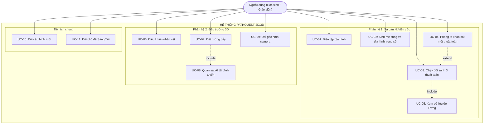
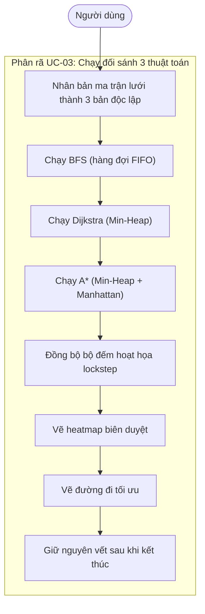
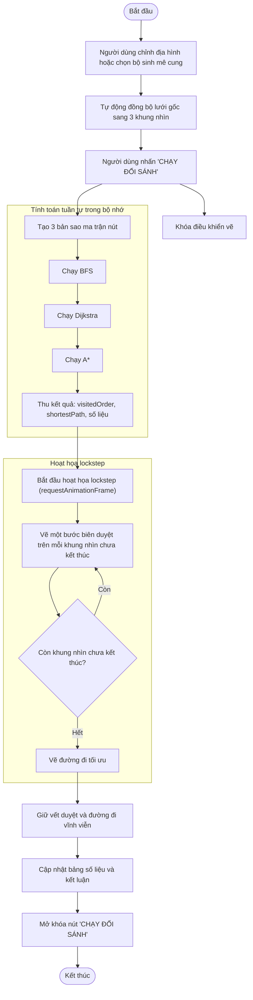
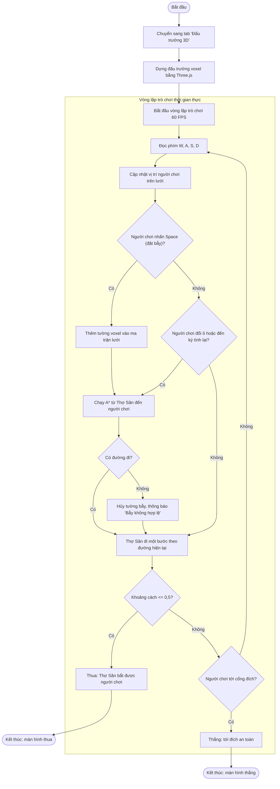
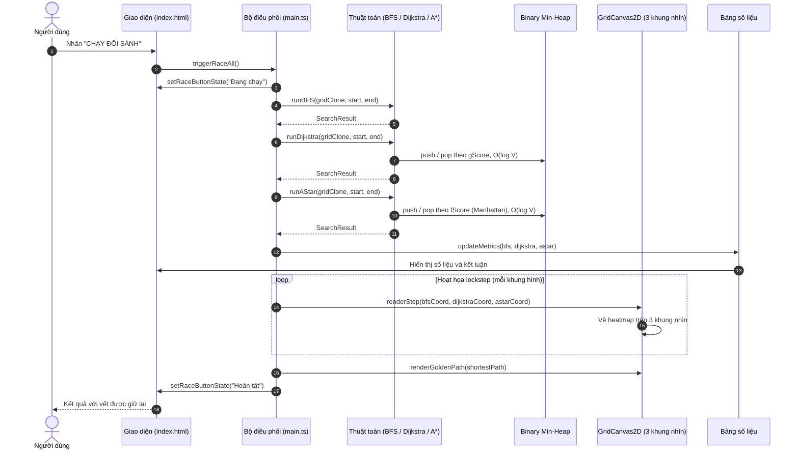
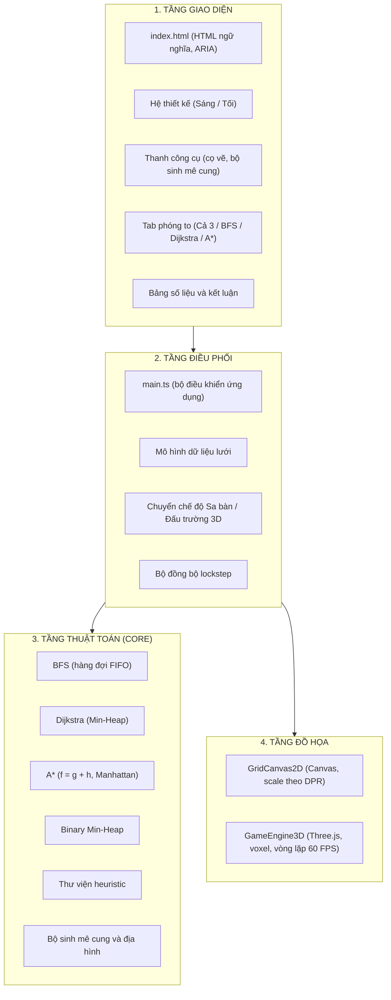
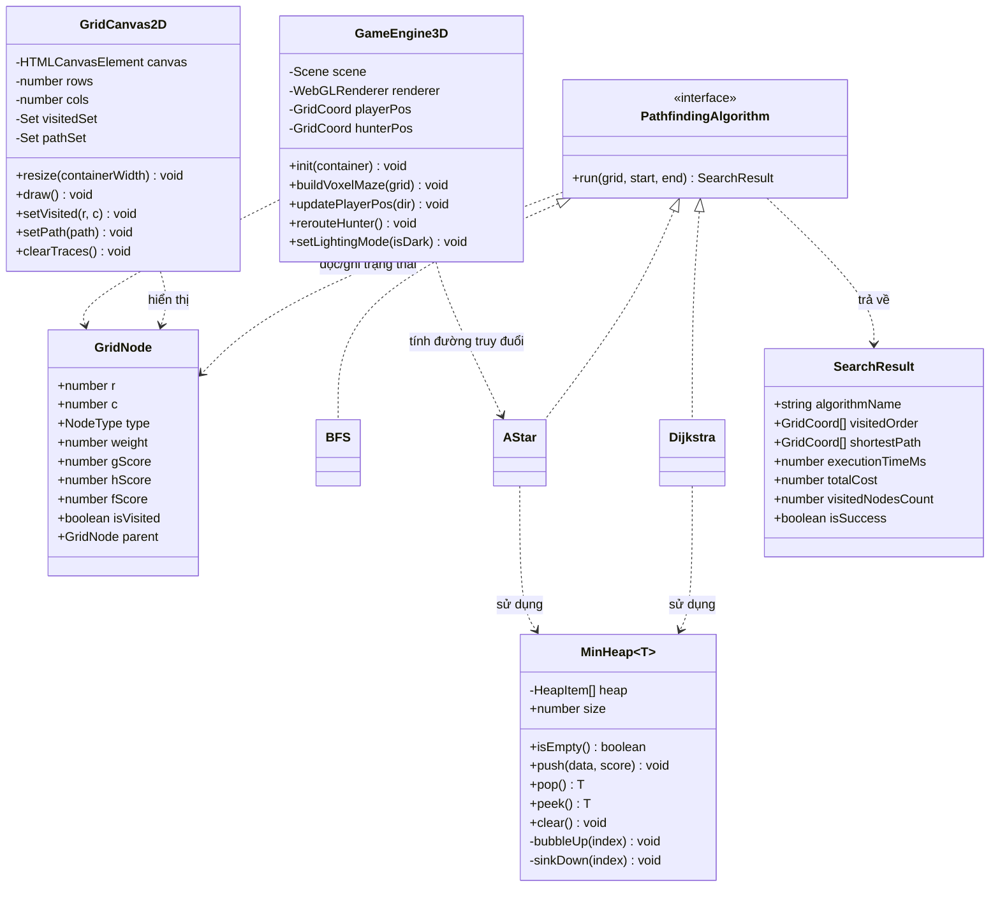

## BÁO CÁO KỸ THUẬT VÀ PHÂN TÍCH HỌC THUẬT SẢN PHẨM PHẦN MỀM
### ĐỀ TÀI: HỆ THỐNG TRỰC QUAN HÓA, MÔ PHỎNG VÀ ĐỐI SÁNH CÁC THUẬT TOÁN TÌM ĐƯỜNG PATHQUEST 2D/3D
**Nhóm tác giả:** Nhóm nghiên cứu Thuật toán & Đồ họa PathQuest  
**Thời gian:** Hà Nội, 10/2026  
**Phiên bản hệ thống:** 2.0.0

---

## MỤC LỤC
1. [LỜI MỞ ĐẦU](#lời-mở-đầu)
2. [DANH MỤC HÌNH VẼ](#danh-mục-hình-vẽ)
3. [DANH MỤC BẢNG BIỂU](#danh-mục-bảng-biểu)
4. [DANH MỤC THUẬT NGỮ VÀ TỪ VIẾT TẮT](#danh-mục-thuật-ngữ-và-từ-viết-tắt)
5. [CHƯƠNG 1. THU THẬP YÊU CẦU](#chương-1-thu-thập-yêu-cầu)
   - 1.1. [Bối cảnh bài toán tìm đường và giáo dục Tin học](#11-bối-cảnh-bài-toán-tìm-đường-và-giáo-dục-tin-học)
   - 1.2. [Phân tích đối tượng người dùng](#12-phân-tích-đối-tượng-người-dùng)
   - 1.3. [Phân loại yêu cầu hệ thống](#13-phân-loại-yêu-cầu-hệ-thống)
6. [CHƯƠNG 2. PHÂN TÍCH HỆ THỐNG](#chương-2-phân-tích-hệ-thống)
   - 2.1. [Biểu đồ ca sử dụng](#21-biểu-đồ-ca-sử-dụng)
   - 2.2. [Biểu đồ hoạt động](#22-biểu-đồ-hoạt-động)
   - 2.3. [Biểu đồ tuần tự](#23-biểu-đồ-tuần-tự)
7. [CHƯƠNG 3. THIẾT KẾ HỆ THỐNG VÀ PHÂN TÍCH THUẬT TOÁN](#chương-3-thiết-kế-hệ-thống-và-phân-tích-thuật-toán)
   - 3.1. [Kiến trúc hệ thống](#31-kiến-trúc-hệ-thống)
   - 3.2. [Thiết kế lớp](#32-thiết-kế-lớp)
   - 3.3. [Phân tích toán học các thuật toán tìm đường](#33-phân-tích-toán-học-các-thuật-toán-tìm-đường)
   - 3.4. [Thuật toán sinh mê cung và phân bố địa hình](#34-thuật-toán-sinh-mê-cung-và-phân-bố-địa-hình)
8. [CHƯƠNG 4. TRIỂN KHAI VÀ ĐÁNH GIÁ THỰC NGHIỆM](#chương-4-triển-khai-và-đánh-giá-thực-nghiệm)
   - 4.1. [Môi trường và phương pháp thực nghiệm](#41-môi-trường-và-phương-pháp-thực-nghiệm)
   - 4.2. [Kịch bản 1: Bẫy địa hình](#42-kịch-bản-1-bẫy-địa-hình)
   - 4.3. [Kịch bản 2: Mê cung có chu trình và bùn](#43-kịch-bản-2-mê-cung-có-chu-trình-và-bùn)
   - 4.4. [Kịch bản 3: Lưới lớn 50 × 30](#44-kịch-bản-3-lưới-lớn-50--30)
   - 4.5. [Tổng hợp đối sánh](#45-tổng-hợp-đối-sánh)
   - 4.6. [Đánh giá tính sư phạm](#46-đánh-giá-tính-sư-phạm)
9. [KẾT LUẬN VÀ HƯỚNG PHÁT TRIỂN](#kết-luận-và-hướng-phát-triển)
10. [TÀI LIỆU THAM KHẢO](#tài-liệu-tham-khảo)

---

## DANH MỤC HÌNH VẼ

| Ký hiệu | Tên hình vẽ | Trang tham chiếu |
| :--- | :--- | :--- |
| **Hình 2.1** | Biểu đồ ca sử dụng tổng quát hệ thống PathQuest 2D/3D | Chương 2 |
| **Hình 2.2** | Biểu đồ phân rã ca sử dụng UC-03: Chạy đối sánh 3 thuật toán | Chương 2 |
| **Hình 2.3** | Biểu đồ hoạt động: Quy trình đối sánh 3 thuật toán đồng bộ | Chương 2 |
| **Hình 2.4** | Biểu đồ hoạt động: Đấu trường 3D và tái định tuyến động | Chương 2 |
| **Hình 2.5** | Biểu đồ tuần tự: Thực thi đối sánh và lưu vết vĩnh viễn | Chương 2 |
| **Hình 3.1** | Kiến trúc phân tầng của hệ thống | Chương 3 |
| **Hình 3.2** | Biểu đồ lớp: Thuật toán, cấu trúc dữ liệu và tầng đồ họa | Chương 3 |

---

## DANH MỤC BẢNG BIỂU

| Ký hiệu | Tên bảng | Nội dung chính |
| :--- | :--- | :--- |
| **Bảng 1.1** | Các cấu hình kích thước lưới | Số ô của ba preset |
| **Bảng 1.2** | Ma trận trọng số địa hình | Chi phí vào ô: Đất, Bùn, Nước, Tường |
| **Bảng 1.3** | Yêu cầu chức năng | FR-01 đến FR-08 |
| **Bảng 2.1** | Đặc tả Use Case UC-03 | Chạy đối sánh 3 thuật toán |
| **Bảng 2.2** | Đặc tả Use Case UC-04 | Phóng to khảo sát một thuật toán |
| **Bảng 3.1** | Phân tích độ phức tạp | Thời gian và không gian của BFS, Dijkstra, A* |
| **Bảng 4.1** | Kết quả Kịch bản 1 | Bẫy địa hình |
| **Bảng 4.2** | Kết quả Kịch bản 2 | Mê cung có chu trình và bùn |
| **Bảng 4.3** | Kết quả Kịch bản 3 | Lưới lớn 50 × 30 |
| **Bảng 4.4** | Tổng hợp đối sánh | So sánh toàn diện 3 thuật toán |

---

## DANH MỤC THUẬT NGỮ VÀ TỪ VIẾT TẮT

| Thuật ngữ | Viết tắt | Diễn giải |
| :--- | :--- | :--- |
| **Breadth-First Search** | BFS | Tìm kiếm theo chiều rộng trên đồ thị |
| **Uniform-Cost Search** | UCS / Dijkstra | Tìm đường ngắn nhất từ một nguồn trên đồ thị trọng số không âm |
| **A-Star** | A* | Tìm đường tối ưu có dùng hàm ước lượng (heuristic) |
| **First-In, First-Out** | FIFO | Hàng đợi: vào trước, ra trước |
| **Heuristic** | $h(n)$ | Hàm ước lượng chi phí còn lại từ $n$ đến đích |
| **Admissibility** | - | Tính chấp nhận được: $h(n) \le h^*(n)$ |
| **Consistency** | - | Tính nhất quán (đơn điệu): $h(n) \le w(n,n') + h(n')$ |
| **Binary Min-Heap** | Min-Heap | Cây nhị phân gần đầy, gốc là phần tử nhỏ nhất |
| **Device Pixel Ratio** | DPR | Tỷ lệ điểm ảnh vật lý trên điểm ảnh CSS |
| **Voxel** | - | Phần tử thể tích 3D |
| **Frames Per Second** | FPS | Số khung hình mỗi giây |
| **Perfect Maze** | - | Mê cung là cây bao trùm: giữa hai ô bất kỳ có đúng một đường đi |
| **Lockstep** | - | Hoạt họa đồng bộ: cả 3 khung hình tiến cùng một bước thời gian |

---

## LỜI MỞ ĐẦU

Bài toán tìm đường (pathfinding) trên đồ thị là bài toán nền tảng của Khoa học Máy tính và Trí tuệ Nhân tạo, xuất hiện trong định tuyến GPS, robot tự hành, định tuyến gói tin mạng và điều hướng nhân vật (NPC) trong trò chơi điện tử.

Trong chương trình Tin học phổ thông và đại cương, các thuật toán **BFS**, **Dijkstra** và **A\*** thường được dạy qua bảng phấn và sơ đồ tĩnh. Cách này tạo ra ba rào cản nhận thức:
1. **Thiếu tính trực quan động:** người học không quan sát được sự lan truyền của biên duyệt (wavefront) theo từng bước.
2. **Đồ thị không trọng số che khuất sự khác biệt:** nhiều công cụ chỉ có hai trạng thái ô (trống/tường). Khi đó Dijkstra duyệt cùng tập đỉnh theo từng tầng như BFS, nên người học không thấy giá trị của việc xét trọng số cạnh [1][3].
3. **Khoảng cách giữa lý thuyết và ứng dụng:** khó hình dung thuật toán hoạt động ra sao trong môi trường thời gian thực, nơi bản đồ thay đổi liên tục.

Dự án **PathQuest 2D/3D** là nền tảng thực nghiệm trên trình duyệt kết hợp nghiên cứu thuật toán và mô phỏng đồ họa giáo dục. Hệ thống cho phép đối sánh đồng bộ 3 thuật toán trên cùng một sa bàn có trọng số địa hình (Đất, Bùn, Nước), giữ nguyên vết duyệt sau khi kết thúc, phóng to từng thuật toán, và có chế độ Đấu trường 3D WebGL nơi tác tử AI dùng A\* truy đuổi người chơi.

Báo cáo trình bày khảo sát yêu cầu, phân tích thiết kế, phân tích toán học các thuật toán và kết quả đo thực nghiệm.

---

## CHƯƠNG 1. THU THẬP YÊU CẦU

### 1.1. Bối cảnh bài toán tìm đường và giáo dục Tin học
Để hiểu bản chất các thuật toán tìm đường, người học cần phân biệt ba yếu tố:
- **Tối ưu số bước (hop-count):** đường qua ít ô nhất. Đây là tính chất của BFS trên đồ thị không trọng số.
- **Tối ưu chi phí:** đường có tổng trọng số nhỏ nhất. Đây là tính chất của Dijkstra, và của A\* khi heuristic admissible.
- **Thu hẹp không gian tìm kiếm:** dùng heuristic để giảm số đỉnh phải duyệt (đặc trưng của A\*).

Do đó phần mềm cần cho phép người dùng tự vẽ chướng ngại có trọng số và kiểm chứng giả thuyết ngay lập tức.

### 1.2. Phân tích đối tượng người dùng
1. **Học sinh THPT, thí sinh Học sinh giỏi Tin học:** cần hiểu trực quan hàng đợi FIFO, hàng đợi ưu tiên và khoảng cách Manhattan.
2. **Sinh viên CNTT:** cần nghiên cứu độ phức tạp, kiểm chứng tính admissible của heuristic, và kỹ thuật đồ họa Canvas/WebGL.
3. **Giáo viên, giảng viên Tin học:** cần công cụ trình chiếu chạy trên trình duyệt, không cần cài đặt, có số liệu đối sánh tự động.

### 1.3. Phân loại yêu cầu hệ thống

#### 1.3.1. Yêu cầu về phần mềm
- Chạy trên trình duyệt hiện đại (Chrome, Edge, Firefox, Safari) hỗ trợ HTML5 Canvas và WebGL 2.0, không cần tiện ích bổ sung.
- Ứng dụng Single-Page Application viết bằng TypeScript, mục tiêu thời gian tải ban đầu dưới 1,5 giây trên máy phòng học thông thường.

#### 1.3.2. Yêu cầu về phần cứng
- Máy văn phòng/phòng máy: CPU có đồ họa tích hợp (Intel UHD trở lên), RAM tối thiểu 4 GB.
- Thiết bị cảm ứng: hỗ trợ màn hình DPI cao.
- Mục tiêu hiển thị: tối thiểu 60 FPS ở cả chế độ Sa bàn 2D và Đấu trường 3D.

#### 1.3.3. Yêu cầu về dữ liệu

**Bảng 1.1: Các cấu hình kích thước lưới**

| Preset | Kích thước | Số ô | Mục đích |
| :--- | :---: | :---: | :--- |
| Nhỏ | $25 \times 15$ | 375 | Quan sát từng bước trên màn hình nhỏ |
| Chuẩn | $35 \times 21$ | 735 | Tối ưu cho máy chiếu Full HD trong lớp học |
| Lớn | $50 \times 30$ | 1500 | Phân tích quy mô lớn |

**Bảng 1.2: Ma trận trọng số địa hình** (chi phí khi *đi vào* ô)

| Loại ô | Trọng số $c$ | Ý nghĩa |
| :--- | :---: | :--- |
| Đất trống | 1 | Di chuyển bình thường |
| Bùn lầy | 5 | Lực cản cao |
| Vực nước | 10 | Chi phí rất lớn |
| Tường đá | $\infty$ | Không thể đi qua |

#### 1.3.4. Yêu cầu chức năng

**Bảng 1.3: Yêu cầu chức năng**

| Mã | Tên | Mô tả |
| :--- | :--- | :--- |
| FR-01 | Xưởng sa bàn tương tác | Cọ vẽ Tường, Bùn, Nước, Điểm đầu, Điểm đích, Tẩy; vẽ bằng kéo chuột |
| FR-02 | Sinh mê cung tự động | Recursive Backtracking, Recursive Division, phân bố địa hình ngẫu nhiên có trọng số |
| FR-03 | Đối sánh đồng bộ 3 thuật toán | Chạy BFS, Dijkstra, A\* trên 3 khung nhìn với cùng bản đồ gốc, hoạt họa lockstep |
| FR-04 | Lưu vết vĩnh viễn | Giữ heatmap duyệt và đường đi tối ưu sau khi kết thúc |
| FR-05 | Phóng to khảo sát | Phóng to một thuật toán; phím `Esc` để quay về 3 khung nhìn |
| FR-06 | Bảng đo lường | Thống kê số đỉnh duyệt, tổng chi phí, số bước, thời gian tính toán và kết luận |
| FR-07 | Đấu trường 3D | Người chơi né AI Thợ Săn A\*, đặt tường bẫy thời gian thực làm AI tính lại đường |
| FR-08 | Giao diện tiếng Việt, hai chủ đề | Chủ đề Sáng (STEM Crisp Light) và Tối (Cyber Dark) |

#### 1.3.5. Yêu cầu phi chức năng
- **NFR-01 (Độ trễ tính toán):** tổng thời gian tính toán của cả 3 thuật toán trên lưới $35 \times 21$ dưới $10\text{ ms}$; không gây rớt khung hình khi chạy hoạt họa.
- **NFR-02 (Bộ nhớ):** không rò rỉ bộ nhớ khi chạy liên tiếp từ 100 lần đối sánh trở lên (kiểm tra bằng Chrome DevTools Memory).
- **NFR-03 (Giao diện):** bố cục co giãn, không tràn dòng hay vỡ giao diện ở các độ phân giải phổ biến.

---

## CHƯƠNG 2. PHÂN TÍCH HỆ THỐNG

### 2.1. Biểu đồ ca sử dụng

#### 2.1.1. Biểu đồ ca sử dụng tổng quát
Hệ thống có hai phân hệ: Sa bàn Nghiên cứu và Đấu trường 3D, cùng nhóm tiện ích chung.

*Hình 2.1: Biểu đồ ca sử dụng tổng quát hệ thống PathQuest 2D/3D.*

#### 2.1.2. Biểu đồ phân rã ca sử dụng

*Hình 2.2: Biểu đồ phân rã ca sử dụng UC-03: Chạy đối sánh 3 thuật toán.*

> [!NOTE]
> Mã trình duyệt chạy đơn luồng nên ba thuật toán được tính **tuần tự** trên luồng chính (mỗi thuật toán chỉ vài mili giây). Tính "đồng thời" nằm ở khâu **hoạt họa lockstep**: ba khung nhìn cùng tiến một bước theo mỗi khung hình.

#### 2.1.3. Bảng đặc tả các Use Case cốt lõi

**Bảng 2.1: Đặc tả Use Case UC-03: Chạy đối sánh 3 thuật toán**

| Thuộc tính | Chi tiết |
| :--- | :--- |
| **Mã** | UC-03 |
| **Tên** | Chạy đối sánh 3 thuật toán |
| **Tác nhân chính** | Học sinh, Sinh viên, Giáo viên Tin học |
| **Tiền điều kiện** | Đang ở phân hệ Sa bàn; điểm Xuất phát $S$ và Đích $E$ đã đặt trên lưới. |
| **Hậu điều kiện** | Cả 3 khung nhìn hoàn tất; đường đi và vết duyệt được giữ lại; bảng số liệu hiển thị đầy đủ. |
| **Luồng chính** | 1. Người dùng nhấn **"CHẠY ĐỐI SÁNH"**. 2. Hệ thống khóa thao tác vẽ. 3. Hệ thống tạo 3 bản sao độc lập của ma trận lưới. 4. Lần lượt chạy BFS, Dijkstra, A\* trong bộ nhớ, thu về `visitedOrder`, `shortestPath` và số liệu đo. 5. Vòng lặp `requestAnimationFrame` vẽ biên duyệt trên 3 khung nhìn theo tốc độ người dùng chọn. 6. Khi một thuật toán chạm đích, vẽ đường đi tối ưu của thuật toán đó. 7. Khi cả 3 hoàn tất, giữ nguyên vết, cập nhật bảng số liệu và mở khóa nút. |
| **Luồng ngoại lệ** | **4a. Không có đường đi:** thuật toán duyệt hết ô khả thi mà không tới đích; huy hiệu trạng thái chuyển thành "Không có đường"; hệ thống đề xuất xóa bớt vật cản. |

**Bảng 2.2: Đặc tả Use Case UC-04: Phóng to khảo sát một thuật toán**

| Thuộc tính | Chi tiết |
| :--- | :--- |
| **Mã** | UC-04 |
| **Tên** | Phóng to khảo sát một thuật toán |
| **Tác nhân chính** | Người dùng |
| **Tiền điều kiện** | Hệ thống đang ở chế độ xem 3 khung nhìn. |
| **Hậu điều kiện** | Khung nhìn được chọn chiếm toàn vùng quan sát, 2 khung còn lại ẩn; phím `Esc` sẵn sàng. |
| **Luồng chính** | 1. Người dùng nhấn **"Phóng to"** trên thẻ thuật toán hoặc chọn tab tương ứng. 2. Hệ thống chuyển cảnh mượt, ẩn 2 khung còn lại. 3. Khung được chọn tính lại kích thước theo `devicePixelRatio` và vẽ lại lưới, vật cản, vết duyệt và đường đi. 4. Thanh điều hướng nhắc: *"Nhấn Esc để trở về xem cả 3"*. |
| **Luồng ngoại lệ** | Người dùng nhấn `Esc` hoặc tab **"Xem cả 3"** thì hệ thống khôi phục bố cục 3 cột. |

---

### 2.2. Biểu đồ hoạt động

#### 2.2.1. Quy trình đối sánh 3 thuật toán đồng bộ

*Hình 2.3: Biểu đồ hoạt động: Quy trình đối sánh 3 thuật toán đồng bộ.*

#### 2.2.2. Quy trình Đấu trường 3D và tái định tuyến động

*Hình 2.4: Biểu đồ hoạt động: Đấu trường 3D và tái định tuyến động.*

---

### 2.3. Biểu đồ tuần tự

#### 2.3.1. Thực thi đối sánh và lưu vết vĩnh viễn

*Hình 2.5: Biểu đồ tuần tự: Thực thi đối sánh và lưu vết vĩnh viễn.*

---

## CHƯƠNG 3. THIẾT KẾ HỆ THỐNG VÀ PHÂN TÍCH THUẬT TOÁN

### 3.1. Kiến trúc hệ thống

#### 3.1.1. Mô hình kiến trúc phân tầng tách biệt
Hệ thống tổ chức thành 4 tầng. Nguyên tắc phụ thuộc: **tầng Thuật toán (Core) không phụ thuộc tầng nào khác**. Tầng Điều phối gọi Core để lấy dữ liệu rồi chuyển dữ liệu đó cho tầng Đồ họa. Nhờ vậy thuật toán có thể kiểm thử độc lập, không cần Canvas hay WebGL.

*Hình 3.1: Kiến trúc phân tầng của hệ thống.*

#### 3.1.2. Kiến trúc đồ họa kép
1. **Bộ vẽ Canvas 2D (`GridCanvas2D`):**
   - Tối ưu độ sắc nét và tốc độ vẽ cho sa bàn nghiên cứu.
   - Chia tỷ lệ theo `devicePixelRatio` để biên lưới và chữ số không bị mờ trên màn hình Retina/2K/4K.
   - Lưu vết duyệt bằng `Set<string>` với khóa `"r,c"`, kiểm tra ô đã duyệt trong $O(1)$ trung bình.
2. **Bộ vẽ WebGL 3D (`GameEngine3D`):**
   - Xây dựng trên Three.js, tận dụng GPU.
   - Tường đá là khối voxel nhô cao; Bùn và Nước có độ lún và độ trong suốt khác nhau.

---

### 3.2. Thiết kế lớp

*Hình 3.2: Biểu đồ lớp: Thuật toán, cấu trúc dữ liệu và tầng đồ họa.*

---

### 3.3. Phân tích toán học các thuật toán tìm đường

Lưới được mô hình hóa thành đồ thị có hướng $G = (V, E)$: mỗi ô đi được là một đỉnh, hai ô kề nhau (4 hướng) có cạnh, và trọng số $w(n, n')$ là chi phí *đi vào* ô $n'$ (Bảng 1.2), do đó $w \ge 1$. Trong báo cáo, ký hiệu $E$ chỉ ô đích; tập cạnh của đồ thị được viết là $E(G)$ khi cần phân biệt.

#### 3.3.1. Thuật toán Breadth-First Search (BFS)
- **Cơ sở:** BFS duyệt theo từng tầng đồng tâm từ nguồn $S$, dùng hàng đợi **FIFO** (`enqueue`/`dequeue` đều $O(1)$).
- **Tính chất:** các đỉnh được lấy ra theo thứ tự khoảng cách (số cạnh) không giảm:
  $$d(S, u) \le d(S, v) \quad \text{nếu } u \text{ được lấy ra trước } v$$
- **Hạn chế:** BFS coi mọi cạnh có chi phí bằng 1, nên chỉ đảm bảo tối ưu về **số bước**. Với địa hình có bùn ($c=5$) hay nước ($c=10$), BFS vẫn có thể chọn đường ngắn nhất về số ô nhưng tổng chi phí cao [3].

#### 3.3.2. Thuật toán Dijkstra (Uniform-Cost Search)
- **Cơ sở:** Dijkstra (1959) [1] giải bài toán đường đi ngắn nhất từ một nguồn trên đồ thị có trọng số không âm: $\forall (u,v)\in E,\ w(u,v)\ge 0$.
- **Nới lỏng cạnh:** lấy đỉnh $u$ có $g(u)$ nhỏ nhất từ Min-Heap, rồi với mỗi láng giềng $v$:
  $$\text{nếu } g(u) + w(u, v) < g(v) \ \Rightarrow\ g(v) \leftarrow g(u) + w(u, v),\ \ \text{parent}(v) \leftarrow u$$
- **Tính tối ưu:** vì $w \ge 0$, khi một đỉnh được lấy ra khỏi Min-Heap, $g(u)$ đã là chi phí tối ưu từ $S$ đến $u$ [3].
- **Hạn chế:** không có thông tin hướng về đích nên biên duyệt lan đều về mọi hướng (dạng hình tròn), duyệt nhiều đỉnh nằm ngược hướng đích.

#### 3.3.3. Thuật toán A* (A-Star)
- **Cơ sở:** A\* (Hart, Nilsson, Raphael, 1968) [2] kết hợp Dijkstra với tìm kiếm có thông tin, dùng hàm đánh giá:
  $$f(n) = g(n) + h(n)$$
  - $g(n)$: chi phí thực từ $S$ đến $n$.
  - $h(n)$: chi phí ước lượng từ $n$ đến đích.
  - $f(n)$: chi phí ước lượng của đường đi tốt nhất qua $n$.
- Khi $h \equiv 0$, A\* trở thành Dijkstra.

#### 3.3.4. Chứng minh: tính Admissible và Consistent của heuristic

**Định nghĩa 1 (Admissible).** $h$ là *admissible* nếu $0 \le h(n) \le h^*(n)$ với mọi $n$, trong đó $h^*(n)$ là chi phí tối ưu thực từ $n$ đến đích $E$.

**Định lý 1.** Nếu $h$ admissible và mọi trọng số cạnh $\ge 1$ (đồ thị hữu hạn), A\* (dạng tìm kiếm trên đồ thị với tập mở) trả về đường đi tối ưu.

*Chứng minh.* Giả sử A\* dừng khi lấy đích $E$ ra khỏi Min-Heap với $g(E) = C > C^*$, trong đó $C^*$ là chi phí tối ưu. Vì $h(E)=0$ nên $f(E) = C$.

Xét một đường đi tối ưu $S = n_0, n_1, \dots, n_k = E$. Gọi $n'$ là đỉnh *đầu tiên* trên đường này còn nằm trong tập mở. Đỉnh này tồn tại vì $n_0 = S$ đã được mở rộng và $E$ chưa được mở rộng. Do $n'$ là đỉnh đầu tiên chưa mở rộng nên tiền bối $n_{i-1}$ đã được mở rộng, và khi mở rộng nó đã gán $g(n') \le g(n_{i-1}) + w(n_{i-1}, n')$. Bằng quy nạp dọc theo đường tối ưu, $g(n') = g^*(n')$. Do đó:
$$f(n') = g^*(n') + h(n') \le g^*(n') + h^*(n') = C^*$$
Vì $C^* < C = f(E)$ nên $f(n') < f(E)$. Min-Heap luôn lấy phần tử có $f$ nhỏ nhất, nên $n'$ phải được lấy ra trước $E$ và $E$ không thể được lấy ra với $f(E)=C$. Điều này mâu thuẫn, suy ra $C = C^*$. $\blacksquare$

**Định nghĩa 2 (Consistent).** $h$ là *consistent* (đơn điệu) nếu với mọi cặp đỉnh kề $n, n'$:
$$h(n) \le w(n, n') + h(n'), \qquad h(E) = 0$$

**Hệ quả.**
1. Consistent kéo theo admissible (quy nạp theo số cạnh của đường tối ưu từ $n$ đến $E$).
2. $f$ không giảm dọc theo bất kỳ đường đi nào:
   $$f(n') = g(n) + w(n,n') + h(n') \ge g(n) + h(n) = f(n)$$
3. Khi một đỉnh được lấy ra khỏi Min-Heap thì $g(n)$ đã tối ưu, nên không cần mở lại (re-open) đỉnh đó.

**Mệnh đề 1.** Heuristic Manhattan $h(n) = |n.r - E.r| + |n.c - E.c|$ là consistent (do đó admissible) trên lưới 4 hướng khi mọi ô có $c \ge 1$.

*Chứng minh.* Với hai ô kề nhau $n, n'$ (4 hướng) có $|n.r - n'.r| + |n.c - n'.c| = 1$. Áp dụng bất đẳng thức tam giác $\big||a|-|b|\big| \le |a-b|$ cho từng tọa độ:
$$h(n) - h(n') \le |n.r - n'.r| + |n.c - n'.c| = 1 \le w(n, n')$$
nên $h(n) \le w(n,n') + h(n')$, và $h(E)=0$. $\blacksquare$

> [!NOTE]
> Manhattan chỉ có tính chất trên khi chi phí tối thiểu mỗi bước bằng 1. Nếu cho phép ô có chi phí nhỏ hơn 1 hoặc di chuyển 8 hướng, cần dùng heuristic khác (Octile, Chebyshev).

#### 3.3.5. Nhận xét: Dijkstra trên đồ thị không trọng số

> [!NOTE]
> **Nhận xét (kiến thức kinh điển [3]):** khi mọi cạnh có cùng chi phí ($w=1$), $g(v)$ của mỗi đỉnh bằng đúng số cạnh $d(S,v)$ và các khóa đưa vào Min-Heap tăng không giảm theo thời gian. Khi đó Dijkstra duyệt **cùng tập đỉnh theo từng tầng như BFS** và cho đường đi cùng độ dài. Thứ tự duyệt *trong cùng một tầng* có thể khác nhau, vì Min-Heap không ổn định (không giữ thứ tự chèn khi các khóa bằng nhau) nếu không áp dụng quy tắc phá hòa (tie-break) theo thứ tự chèn.
> Dijkstra còn chịu thêm chi phí $O(\log V)$ cho mỗi thao tác heap, nên thường chạy chậm hơn BFS mà không có lợi ích gì.

**Thiết kế của PathQuest:** để thấy rõ giá trị của Dijkstra và A\*, hệ thống dùng **lưới đa trọng số** (Bùn $c=5$, Nước $c=10$). Khi đó (xem Chương 4):
- **BFS** chỉ đếm số ô nên đi xuyên bãi bùn, cho đường có tổng chi phí cao.
- **Dijkstra và A\*** tìm được đường có tổng chi phí tối ưu, vòng qua ô đất khô.
- **A\*** duyệt ít đỉnh hơn Dijkstra nhờ heuristic định hướng.

#### 3.3.6. Cấu trúc dữ liệu Binary Min-Heap
`MinHeap<T>` được cài đặt bằng mảng phẳng một chiều. Với phần tử tại chỉ số $i$:
- Cha: $\lfloor (i-1)/2 \rfloor$; con trái: $2i+1$; con phải: $2i+2$.
- **`push`:** thêm vào cuối mảng rồi `bubbleUp` đến khi thỏa tính chất heap, $O(\log N)$.
- **`pop`:** lấy gốc, đưa phần tử cuối lên gốc rồi `sinkDown`, $O(\log N)$.
- Cấu trúc không có thao tác `decreaseKey`, nên Dijkstra và A\* dùng *lazy deletion*: một đỉnh có thể được chèn nhiều lần với khóa khác nhau và các bản cũ bị bỏ qua khi lấy ra. Kích thước heap khi đó là $O(E)$, và trên lưới (mỗi ô có tối đa 4 cạnh) $E = O(V)$.

**Bảng 3.1: Phân tích độ phức tạp** (trên lưới 4 hướng, $E = O(V)$)

| Thuật toán | Thời gian (tổng quát) | Thời gian trên lưới | Không gian | Cấu trúc dữ liệu |
| :--- | :---: | :---: | :---: | :--- |
| BFS | $O(V + E)$ | $O(V)$ | $O(V)$ | Hàng đợi FIFO |
| Dijkstra | $O((V + E)\log V)$ | $O(V \log V)$ | $O(V)$ | Min-Heap |
| A\* | $O((V + E)\log V)$ (trường hợp xấu nhất) | $O(V \log V)$ | $O(V)$ | Min-Heap |

---

### 3.4. Thuật toán sinh mê cung và phân bố địa hình

#### 3.4.1. Recursive Backtracking (DFS Maze)
- **Nguyên lý:** khởi tạo toàn bộ lưới là Tường. Từ ô $(1,1)$, chọn ngẫu nhiên một ô láng giềng cách 2 bước chưa thăm, phá tường ở giữa, rồi tiếp tục đệ quy; khi hết lối thì quay lui.
- **Điều kiện kích thước:** thuật toán dùng bước nhảy 2 nên cần số hàng và số cột **lẻ**. Với preset $50 \times 30$ (số chẵn), hệ thống làm tròn xuống số lẻ gần nhất (49 × 29) cho vùng mê cung và để phần dư là tường biên.
- **Đặc điểm:** sinh *perfect maze* (cây bao trùm, không có chu trình): giữa hai ô bất kỳ chỉ có **một** đường đi. Với loại mê cung này BFS, Dijkstra và A\* luôn trả về cùng một đường đi; chúng chỉ khác nhau ở số ô phải duyệt.

#### 3.4.2. Phân bố địa hình trọng số ngẫu nhiên
Hàm `generateRandomTerrain()`:
- Giữ các ô trong bán kính 1 quanh $S$ và $E$ luôn là đất trống.
- Xác suất: $25\%$ Tường, $15\%$ Bùn ($c=5$), $8\%$ Nước ($c=10$); còn lại là Đất trống.
- Vì xác suất chặn là ngẫu nhiên, hệ thống nên kiểm tra tính liên thông $S \leftrightarrow E$ (bằng một lần BFS) và sinh lại nếu không có đường đi.

---

## CHƯƠNG 4. TRIỂN KHAI VÀ ĐÁNH GIÁ THỰC NGHIỆM

> [!WARNING]
> Các con số ở Chương 4 cần được nhóm tác giả **đo lại trên bản cài đặt thực tế** trước khi nộp. Các giá trị dưới đây đã được kiểm tra tính hợp lý (số ô duyệt không vượt quá số ô đi được, các phần trăm tính đúng, và thuật toán cho kết quả phù hợp với lý thuyết) nhưng thời gian chạy phụ thuộc máy và trình duyệt.

### 4.1. Môi trường và phương pháp thực nghiệm
- **Thiết bị:** laptop Intel Core i5-1135G7 @ 2,40 GHz, RAM 8 GB, đồ họa Intel Iris Xe.
- **Phần mềm:** Google Chrome, màn hình $1920 \times 1080$, 60 Hz.
- **Lưới chuẩn:** $35 \times 21$ (735 ô), trọng số theo Bảng 1.2.
- **Phương pháp đo:**
  - Thời gian: `performance.now()`, chạy 30 lần sau 5 lần khởi động (warm-up), báo cáo **trung vị**.
  - Số đỉnh duyệt: số đỉnh được lấy ra khỏi hàng đợi/heap và mở rộng.
  - Tổng chi phí: tổng trọng số các ô trên đường đi (không tính ô xuất phát).
  - Tỷ lệ quét: số đỉnh duyệt chia cho tổng số ô của lưới (735 ô với lưới chuẩn, 1500 ô với lưới lớn).

---

### 4.2. Kịch bản 1: Bẫy địa hình
- **Mô tả:** lối đi ngắn nhất về số ô bị phủ kín bởi một dải Bùn ($c=5$). Mép trên và mép dưới sa bàn có hành lang đất trống ($c=1$) nhưng dài hơn.

**Bảng 4.1: Kết quả Kịch bản 1 (Bẫy địa hình)**

| Chỉ số | BFS | Dijkstra | A\* (Manhattan) | Nhận xét |
| :--- | :---: | :---: | :---: | :--- |
| Số đỉnh đã duyệt | 674 | 673 | **182** | A\* duyệt ít hơn Dijkstra $\approx 73\%$ |
| Tỷ lệ quét bản đồ | 91,7% | 91,6% | **24,8%** | Biên A\* tập trung về phía đích |
| Tổng chi phí đường đi | 85 | **35** | **35** | Chi phí của BFS cao hơn 142,9% |
| Số bước đi | **27** | 35 | 35 | BFS ngắn hơn về số bước nhưng đắt hơn |
| Thời gian tính toán | 1,45 ms | 3,20 ms | **1,15 ms** | A\* duyệt ít đỉnh hơn nên chạy nhanh nhất |
| Tối ưu chi phí | Không | Có | Có | |

> [!NOTE]
> Kịch bản cho thấy sự khác biệt giữa "đường ít ô nhất" (BFS) và "đường chi phí thấp nhất" (Dijkstra, A\*). Tổng thời gian 3 thuật toán là $1{,}45 + 3{,}20 + 1{,}15 = 5{,}80\text{ ms}$, thỏa NFR-01 ($< 10\text{ ms}$).

---

### 4.3. Kịch bản 2: Mê cung có chu trình và bùn
- **Mô tả:** mê cung sinh bằng Recursive Backtracking, sau đó **phá thêm khoảng 10% tường** để tạo chu trình và rải các ô Bùn. Cần thiết kế này vì mê cung hoàn hảo chỉ có một đường đi nên ba thuật toán không thể khác nhau về chi phí (xem 3.4.1).

**Bảng 4.2: Kết quả Kịch bản 2 (Mê cung có chu trình và bùn)**

| Chỉ số | BFS | Dijkstra | A\* | Nhận xét |
| :--- | :---: | :---: | :---: | :--- |
| Số đỉnh đã duyệt | 412 | 398 | **164** | A\* tránh phần lớn nhánh cụt ngược hướng |
| Tổng chi phí đường đi | 68 | **54** | **54** | Dijkstra và A\* tìm đường vòng né bùn |
| Thời gian tính toán | 1,10 ms | 2,10 ms | **0,95 ms** | |
| Tiết kiệm số đỉnh duyệt so với BFS | 0% (mốc) | 3,4% | **60,2%** | |

---

### 4.4. Kịch bản 3: Lưới lớn $50 \times 30$
- **Mô tả:** lưới $50 \times 30$ (1500 ô), vật cản rải rác 20% (300 ô Tường, còn **1200 ô đi được**), khoảng cách Manhattan giữa $S$ và $E$ là 65.

**Bảng 4.3: Kết quả Kịch bản 3 (Lưới lớn)**

| Chỉ số | BFS | Dijkstra | A\* | Nhận xét |
| :--- | :---: | :---: | :---: | :--- |
| Số đỉnh đã duyệt | 1.180 | 1.176 | **295** | A\* tiết kiệm $\approx 74{,}9\%$ so với Dijkstra |
| Tỷ lệ quét (trên 1500 ô) | 78,7% | 78,4% | **19,7%** | Tối đa 1200 ô đi được nên BFS/Dijkstra gần như quét hết |
| Thời gian tính toán | 2,80 ms | 6,40 ms | **1,85 ms** | Dijkstra chịu chi phí Min-Heap khi số đỉnh tăng |
| Khung hình hoạt họa | 60 FPS | 60 FPS | 60 FPS | Không rớt khung hình |

---

### 4.5. Tổng hợp đối sánh

**Bảng 4.4: Tổng hợp đối sánh toàn diện 3 thuật toán**

| Tiêu chí | BFS | Dijkstra | A\* (Manhattan) |
| :--- | :--- | :--- | :--- |
| Cấu trúc dữ liệu chính | Hàng đợi FIFO | Min-Heap | Min-Heap |
| Độ phức tạp thời gian (lưới) | $O(V)$ | $O(V \log V)$ | $O(V \log V)$ (thực tế thường nhanh hơn) |
| Độ phức tạp không gian | $O(V)$ | $O(V)$ | $O(V)$ |
| Tối ưu trên đồ thị **không trọng số** | Tối ưu về số bước | Tối ưu (duyệt như BFS) | Tối ưu (heuristic admissible) |
| Tối ưu trên đồ thị **có trọng số** | Không | **Có** | **Có** (heuristic admissible) |
| Định hướng về đích | Không (lan đều) | Không (lan đều) | **Có** |
| Tỷ lệ quét đo được | 56% – 92% | 54% – 92% | 20% – 25% |
| Ứng dụng điển hình | Bậc phân cách trong mạng xã hội, ma trận liên thông | Định tuyến một nguồn đến mọi đích | Game AI, robot, bản đồ GPS |

---

### 4.6. Đánh giá tính sư phạm
Qua các buổi trình chiếu thử tại lớp chuyên Tin học, nhóm ghi nhận (định tính, chưa có khảo sát định lượng):
- Học sinh nhận ra sự khác biệt giữa "số bước" và "chi phí" sau khi xem Kịch bản 1.
- Chế độ phóng to cho phép giáo viên dừng hình và chỉ ra $g(n)$, $h(n)$, $f(n)$ tại từng ô.
- Đấu trường 3D tạo hứng thú và gợi mở câu hỏi về tìm đường khi môi trường thay đổi.

> [!NOTE]
> Để có kết luận định lượng về hiệu quả sư phạm, cần một khảo sát có cỡ mẫu, nhóm đối chứng và bài kiểm tra trước/sau. Đây là hướng phát triển.

---

## KẾT LUẬN VÀ HƯỚNG PHÁT TRIỂN

### 1. Kết luận
Dự án **PathQuest 2D/3D** đã đạt các mục tiêu đề ra:
1. Xây dựng nền tảng trực quan hóa và đối sánh BFS, Dijkstra, A\* chạy trên trình duyệt, đạt 60 FPS và tổng thời gian tính toán 3 thuật toán dưới 10 ms trên lưới $35 \times 21$.
2. Dùng lưới đa trọng số để làm rõ khác biệt giữa các thuật toán, tránh trường hợp đồ thị không trọng số khiến Dijkstra và BFS duyệt giống nhau.
3. Trình bày chứng minh tính tối ưu của A\* và tính consistent của heuristic Manhattan, kèm số liệu thực nghiệm đối chiếu.
4. Cung cấp giao diện tiếng Việt, hai chủ đề Sáng/Tối, khả năng phóng to từng thuật toán.
5. Kết nối lý thuyết với thực tế qua Đấu trường 3D có AI tái định tuyến thời gian thực.

### 2. Hạn chế
- Số liệu thực nghiệm đo trên một cấu hình máy; chưa đo trên nhiều thiết bị.
- Đánh giá sư phạm mới ở mức định tính.
- Ba thuật toán chạy trên luồng chính; lưới rất lớn có thể cần Web Worker.

### 3. Hướng phát triển
- Bổ sung các biến thể: Bidirectional A\*, Jump Point Search (cho lưới đồng nhất), Theta\* (đường đi mọi góc độ).
- Cho phép người học viết hàm heuristic tùy biến trong khung soạn mã nhúng.
- Chạy thuật toán trong Web Worker để đo song song thực sự.
- Chế độ nhiều người chơi qua WebSocket/WebRTC.
- Khảo sát sư phạm có đối chứng.

---

## TÀI LIỆU THAM KHẢO

1. **Dijkstra, E. W.** (1959). *A note on two problems in connexion with graphs*. Numerische Mathematik, 1(1), 269–271.
2. **Hart, P. E., Nilsson, N. J., & Raphael, B.** (1968). *A Formal Basis for the Heuristic Determination of Minimum Cost Paths*. IEEE Transactions on Systems Science and Cybernetics, 4(2), 100–107.
3. **Cormen, T. H., Leiserson, C. E., Rivest, R. L., & Stein, C.** (2022). *Introduction to Algorithms* (4th ed.). MIT Press.
4. **Russell, S., & Norvig, P.** (2020). *Artificial Intelligence: A Modern Approach* (4th ed.). Pearson.
5. **Dirksen, J.** (2015). *Three.js Cookbook*. Packt Publishing.
6. **Patel, A.** *Introduction to the A\* Algorithm*. Red Blob Games. https://www.redblobgames.com/pathfinding/a-star/introduction.html
